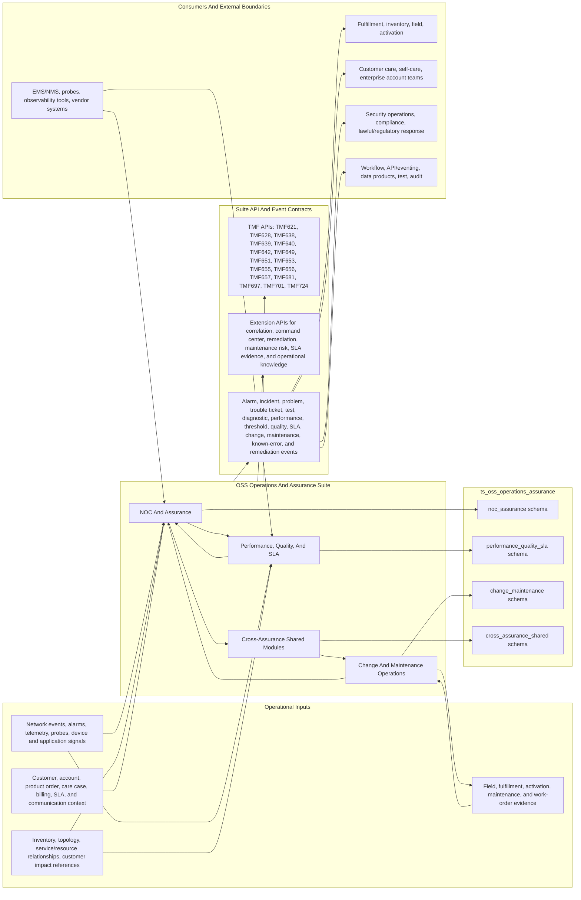
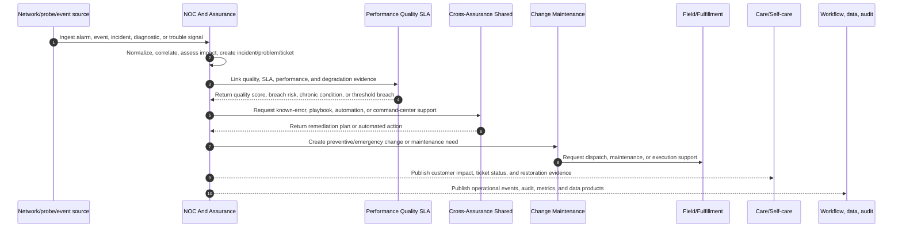
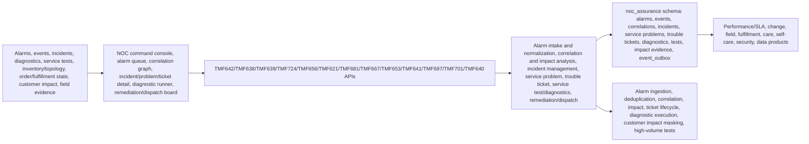
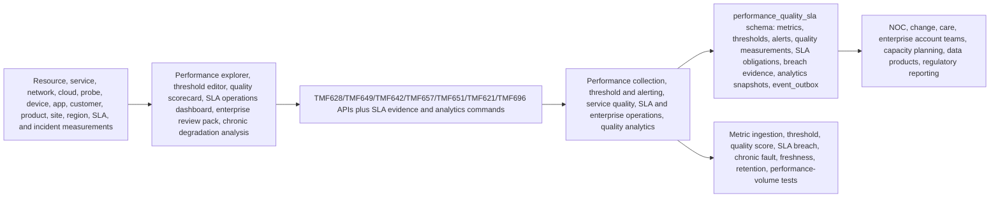
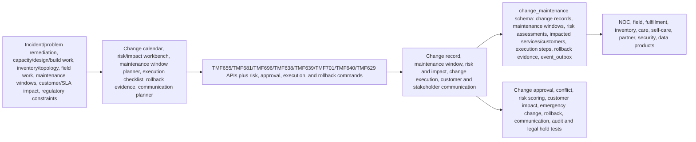
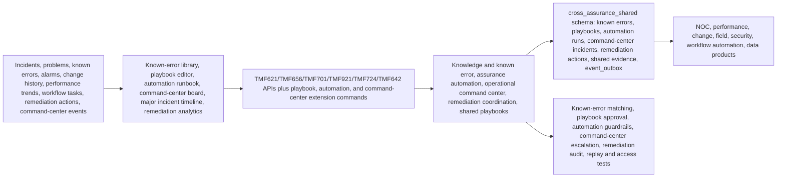

# OSS Operations And Assurance Architecture Diagrams

Reviewed: 2026-06-14

## Purpose

Use these diagrams when building the OSS Operations And Assurance suite and its apps. They clarify how alarms, incidents, service problems, trouble tickets, performance, SLA, change, maintenance, knowledge, remediation, and command-center operations work together.

Primary sources:

- [Implementation File Usage Guide](implementation-file-usage-guide.md)
- [Tech And UI Guidance](tech-and-ui-guidance.md)
- [Data Model](data-model.md)
- [Journey Coverage](journey-coverage.md)
- App `implementation-file-usage.md`, `README.md`, `modules-and-features.md`, `personas-and-user-journeys.md`, and `features/` detail packs
- [TMF API To DDL Traceability Matrix](../tmf-api-to-ddl-traceability-matrix.md)
- `database/postgres/suites/ts_oss_operations_assurance/`

## Suite Architecture

## Suite Build Flow

## App Architecture: NOC And Assurance

## App Architecture: Performance, Quality, And SLA

## App Architecture: Change And Maintenance Operations

## App Architecture: Cross-Assurance Shared Modules

## Build Use

Use these diagrams to keep assurance writes in the owning app: NOC owns alarms/incidents/problems/tickets, Performance owns measurements/quality/SLA, Change owns maintenance/change execution, and Cross-Assurance owns shared knowledge, playbooks, automation, and command-center state.
